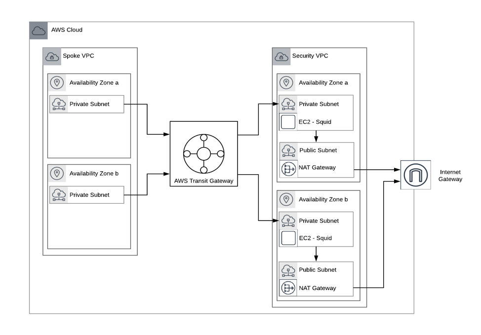
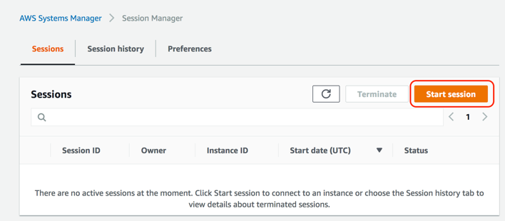
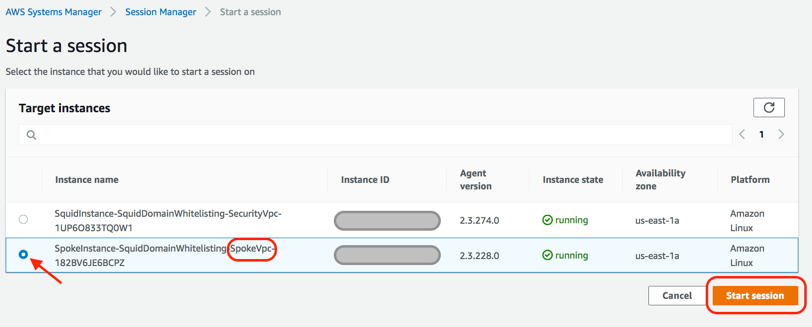

## AWS Transit Gateway Egress Filtering

In a prior post: https://aws.amazon.com/blogs/security/how-to-add-dns-filtering-to-your-nat-instance-with-squid/, AWS showed how you can add DNS filtering in your VPC by routing the traffic through a NAT instance by running Squid as a transparent proxy between your VPC and the internet. This is quite useful, but many organizations have a multi-account and multi-vpc strategy and because VPC Peering is not transitive, you would need to add a squid proxy to every VPC. This would add a significant amount of overhead in both cost and effort as the number of VPCs increases.

However, with the AWS Transit Gateway, you can centralize your egress through a single VPC and apply the DNS filtering in the security VPC, greatly simplifying your AWS VPC networks.




## Deploying the Solution
This sample solution will first deploy a security VPC connected to a transit gateway. The VPC will provide a set of EC2 instances running Squid in a transparent proxy mode implementing hostname whitelisting.

Once the CloudFormation stack has completed, you can deploy one to many spoke VPCs using the SpokeVpc template. There is an option in the Spoke VPC to include a set of test instances that you can test the egress filtering.

To deploy the security VPC, download the template [SquidSecurityVpc.yaml](SquidSecurityVpc.yaml). To deploy the stack we will use the AWS command line interface (CLI). Alternatively you can use the AWS console to deploy the stack.

For this example, we will deploy the stack to us-east-1 overriding the AZ Count from a default of 1 to 2 and adding amazonaws.com, amazon.com, google.com, and twitter.com to the domain name whitelist.

Parameter | Default | Notes
------ | ------ | ------
Domains | amazonaws.com | A comma separated list of domains to whitelist. You will need amazonaws.com in order for systems manager to work correctly.
CidrBlock | 10.0.0.0/16 | The CIDR block for the security VPC.
AZCount | 1 | Either 1 or 2

```
aws cloudformation deploy --template-file SquidSecurityVpc.yaml --stack-name security-vpc --parameter-overrides Domains=amazonaws.com,google.com,amazon.com,twitter.com AZCount=2 --capabilities CAPABILITY_IAM --region us-east-1

```

The default CIDR range of 10.0.0.0/16 for this VPC. Keep in mind you can't have overlapping CIDR ranges in the transit gateway. When the stack has completed, you can create the Spoke VPCs.

Parameter | Default | Notes
------ | ------ | ------
CidrBlock | 10.10.0.0/16 | The CIDR block for this Spoke VPC.
SubnetCidrBlock | 10.0.0.0/24 | The CIDR block for the subnet 1 of the VPC. 
SubnetCidrBlock2 | 10.0.1.0/24 | he CIDR for the second AZ. This is optional, and an empty value will not create a second subnet. You don’t need to have a multi-az Security VPC to create multiple AZs in the spoke, and you don’t need multiple AZs in the spokes if there are multiple AZs in the Security VPC.
ParentStackName | _required_ | The name of the stack that created the Security VPC
CreateTestInstance | Yes | (Yes/No) If yes, it will deploy a test instance into each AZ of the spoke. These will be available in the Systems Manager Session Manager console, so you can run linux shell and test the whitelisting using curl commands, provided that amazonaws.com is whitelisted in the squid instances.

```
aws cloudformation deploy --template-file SpokeVpc.yaml --stack-name spoke-vpc --parameter-overrides ParentStackName=security-vpc --capabilities CAPABILITY_IAM --region us-east-1
```

Once the security VPC is created, create a new VPC, called spoke-vpc. This VPC will contain the applications and systems that will consume services hosted on amazonaws.com.


## Testing the Deployment
Once the stack has created the security VPC and a single spoke VPC with a test instance running in the spoke. In order to test the domain whitelisting, use the Systems Manager Session Manager to connect to a Linux shell to the instance.

1.	Go to the AWS Admin Console and search for ‘Systems Manager’.
2.	On the navigation pane, select ‘Session Manager’.
3.	Click ‘Start Session’ on the main window.  
4.	There should be 2 instances, select the spoke instance: 
5.	From the command shell, run the curl command to test out the web access.
```
curl http://www.amazon.com
curl https://www.amazon.com
curl https://www.amazon.ca
```
The first two curl commands should successfully return the amazon website. The third item should fail because it does not have the amazon.ca domain.

6.	Delete the stacks when you are complete, as the instances will be incur charges.


## Other Firewalls
Any network firewall can be deployed in the security VPC. 3rd party solutions such as Palo Alto can be deployed on the security VPC and provide traffic inspection on incoming and outgoing traffic.


## License Summary

This sample code is made available under a modified MIT license. See the LICENSE file.
